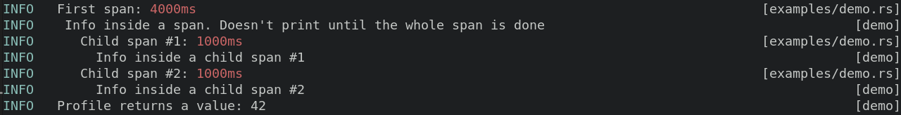

# tree-logger

Log and profile nested code. Supports multi-threading.

## Basic usage

```rust
use tree_logger::TreeLogger;

TreeLogger::new()
    .with_colors(true)
    .with_threads(true)
    .init()
    .unwrap();
log::warn!("This is an example message.");
```

## Output example



## Caveats

Not much time has been put into making this as performant as it could be (yet!). It's a simple solution that makes a reasonable set of assumptions. If you think you could do better you're probably right :)
